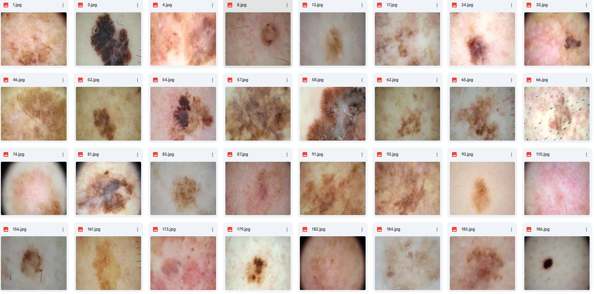

# Melanoma Classification Model Validation and Bias Mitigation 
## Motivation
As clinical research scientists it is essential to be able to both develop and evaluate complex models that may be used to improve patient care. evaluation bias occurs when the data used to train a model doesn't accurately represent the real world, leading to inaccurate prediction and an overestimation of model performance metrics. Therefore it is useful to validate performance metrics of a model on data that it has never seen before (model validation).

The model we will be evaluating was developed by the user lizardwineto detect melanoma from skin lesion images. It works by processing an input image (size 224x224) pixels and outputs a binary classification indicting whether the lesion is cancerous or not. The model is trained to discriminate between malignant and bengign moles.

The developer of this melanoma classification models claims it performs with ~99% accuracy on the dataset that it was trained on. Let's see how it does on new data that it has never seen before! We will use the model to predict melanoma and compare the models predictions to the images' actual labels.

## Model Information
Model information: https://huggingface.co/lizardwine/Melanoma-003

- Model type: Convolutional Neural Network (CNN)
- Trained on Skin Dataset: https://www.kaggle.com/datasets/shashanks1202/skin-cancer-dataset
- Input: 224x224 RBG images of skin lesions
- Output: A binary classification (Melanoma or Not Melanoma)
- Purpose: To identify and classify skin lesions as melanoma or non-melanoma with "high accuracy".

## Testing Dataset information
- This dataset contains images of skin lesions categorized into two cases: malignant and benign. It is organized in two folders. This dataset is from the https://www.kaggle.com/datasets/fanconic/skin-cancer-malignant-vs-benign. All the rights of the Data are bound to the ISIC-Archive rights (https://www.isic-archive.com/#!/topWithHeader/wideContentTop/main).
- Malignant: This folder contains images of skin lesions that have been diagnosed as malignant.
- Benign: this folder includes images of benign skins lesions, which are non-cancerous.

Here is what the testing dataset looks like: 

Example of individual picture classification:

## Results
In the case of this melanoma classification model, evaluation bias may occur when the model appears to have high performance metrics but performs poorly in real-world settings. This can happen when inappropriate performance metrics are used (e.g., using accuracy for an imbalanced dataset), when training and testing datasets are not properly partitioned for model development and evaluation, or when the model is applied to images it was not designed for (e.g., a model trained to diagnose melanoma from pictures taken using a ‘dermatoscope’ but was used on data from pictures of moles taken on a standard camera with poorer quality).
